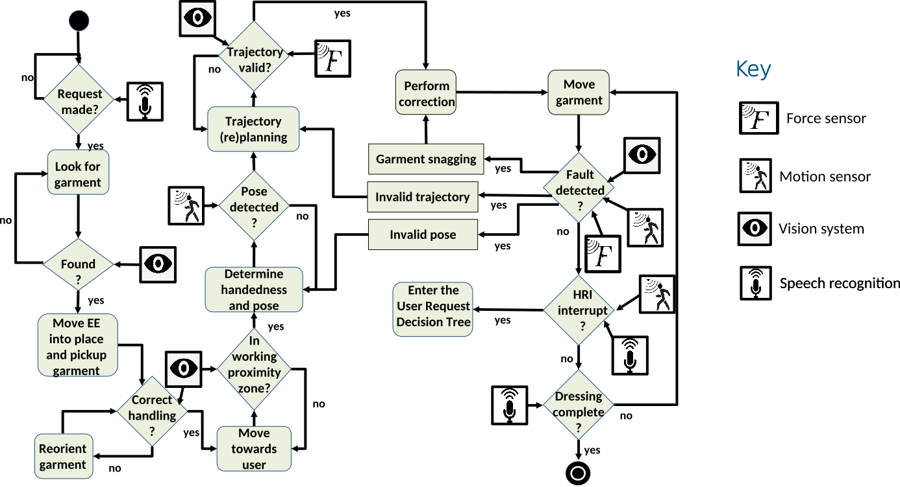
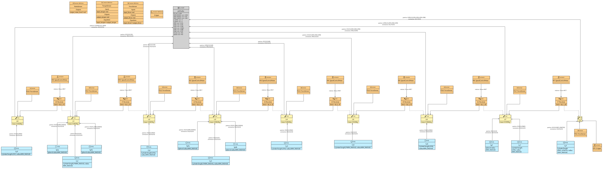
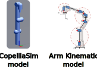
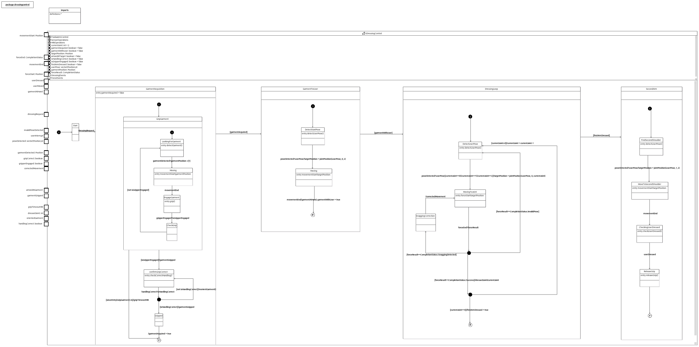
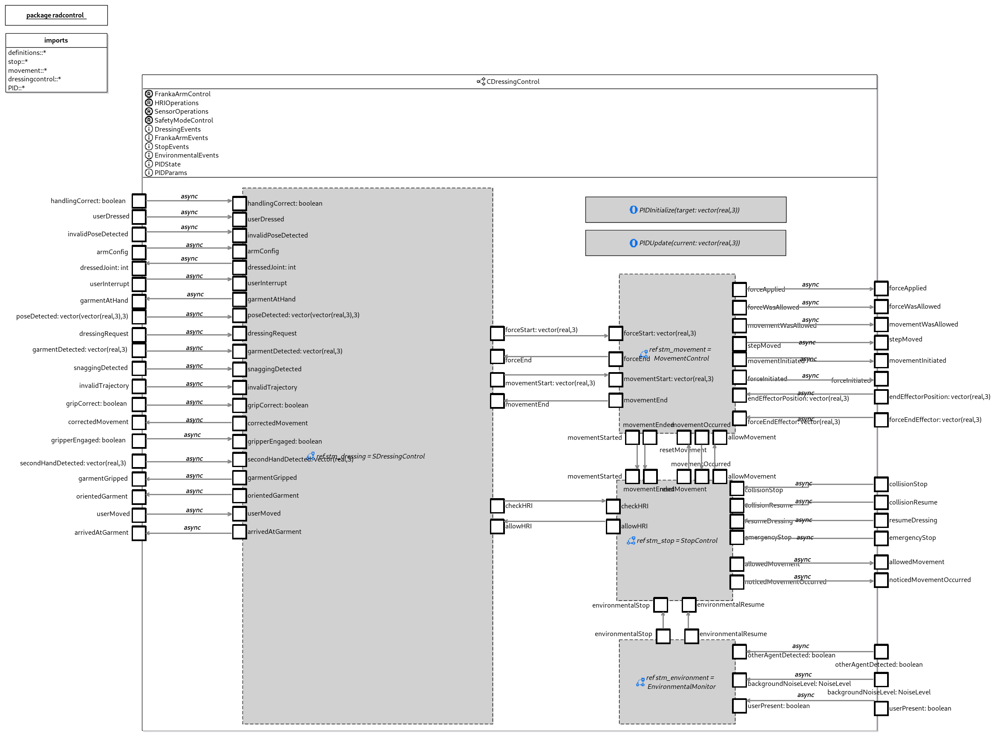
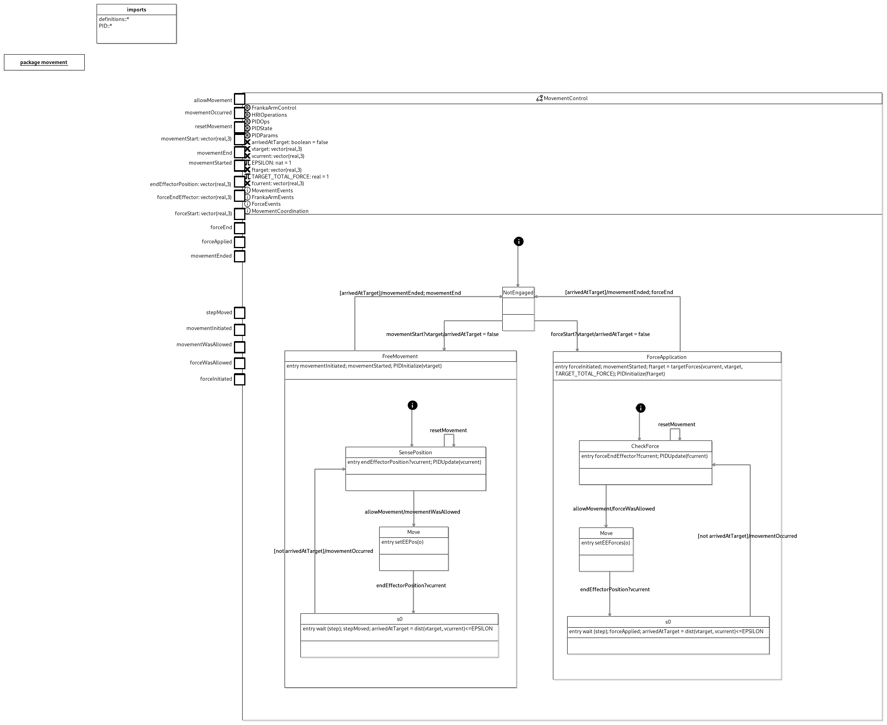
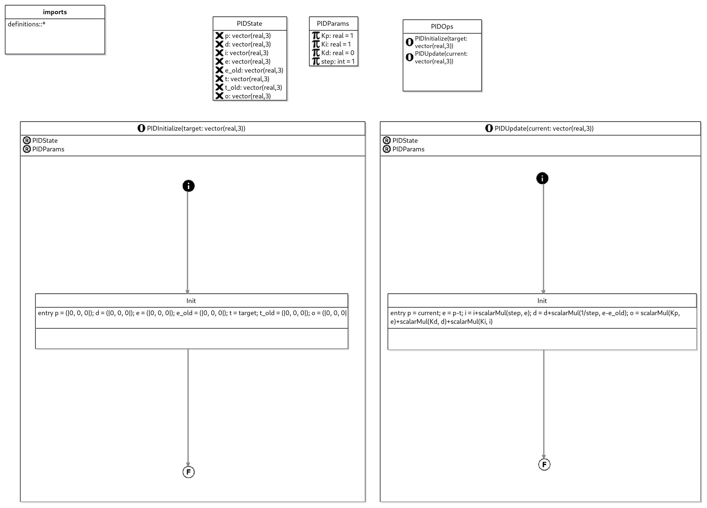
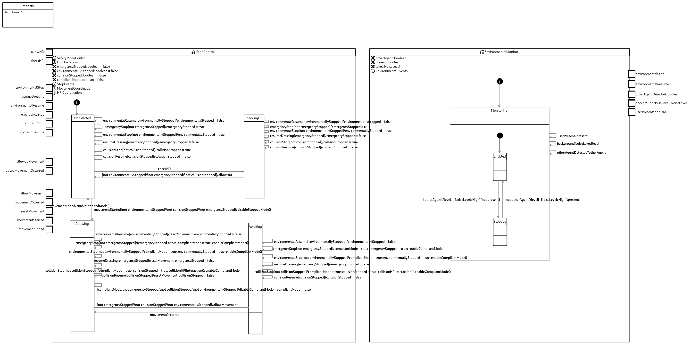

# Trustworthy Autonomous Systems Robot-Assisted Dressing Case Study

Patients with limited physical mobility frequently require assistance in daily
living tasks such as getting dressed.
Whilst this assistance is typically provided by human caregivers, a combination
of ageing populations and a shortage of caregivers, motivates the development
of robotic assistants to supplement the supply of human caregivers.
Additionally, robotic assistance has the potential to increase the independence
and privacy of patients, by allowing them to perform a wider ranger of tasks
without the involvement of professional or informal caregivers.

This case study involves a robotic assistant of aiding patients with limited
upper limb mobility (such as many stroke survivors) in getting dressed.
Specifically, we look at the use of a robotic arm to perform a 
jacket dressing task, where the robotic arm picks up one arm of a jacket, moves
this over the impaired arm of the user, and then places the garment
appropriately to allow the user to complete the dressing task with their
unimpaired arm.

The modelling and verification aspects of this case study were carried out as
part of the Trustworthy Autonomous Systems (TAS) Verifiability Node, whilst a
physical version of the dressing robot was carried in Sheffield as part of the
TAS Resilience Node.

## Robotic Platform

The robotic platform consists of a 7 Degrees-of-Freedom (DoF) Franka-Emika robotic
arm.
This is augmented with a gripper device and a force sensor used to detect the
force vector at the end of the gripper.
The pose of the user is detected using a RGB-D camera, this the robot
communicates with the user via voice commands.

## Dressing Flow and Sensors

The following diagram (adapted from [5]) shows the main control flow for the
dressing process including how each of the different sensors is used during the
dressing process. 

## Robot Arm Model

We modelled the Franka-Emika arm at the centre of this case study as a RoboSim
p-model.
This has the following structure, including the kinematic chain making up the
7oF arm, as well as the end effector, alongside each of the actuators of the arm
and the end-effector force sensor.


This was used to generate a SDF file for the arm, which can be realised as a 3D
model for visualisation and simulation in standard robotics such as CoppeliaSim
and Gazebo.



## Dressing Controller

We modelled the central dressing controller driving the dressing process 
in RoboChart.
We split this into two versions with differing level of detail, as a means to
apply different types of verification to the case study.

### Dressing Controller: Simple Model
Firstly, we have a simple model, which just contains just a single state
machine corresponding to the core dressing flow of the robot. 

This treats the movement of the robot at a rather high-level, with movement
started by `movementStart` and `forceStart` events which are assumed to be
provided by the robotic platform to perform position control or force control to
move towards as desired target attention, coupled with corresponding
`movementStop` and `forceStop` events marking when the movement has been
concluded.

### Dressing Controller: Full Model
We also have a much more complex version of the model which combines several
state machines in addition to the core dressing flow modelling different 
aspects of the dressing controller.

The following diagram shows the overall structure of the controller:


This consists of the following components.

### Core Dressing Control

The `SDressingControl` state machine is the same as the simple model, except the
movement events are implemented in the other modules of the controller
rather than provided directly from the movement platform, and additional
`checkHRI` and `allowHRI` events are used to block the dressing process at
certain points.


### Movement Control and PID

The `MovementControl` implements the actual movement of the robot arm end
effector to a given point. It has two modes:
1. Position Control: directly control the position of the end effector to move
   towards the desired target. This is used when the robot arm is moving in free
   space.
2. Force Control: control the force applied at the end effector to move towards
   the desired target, using the force sensor at the end effector.



Both of these are implement as PID feedback loops using the following operations
which implements a reusable PID feedback loop.



### Stop Control and Environmental Monitor

The `StopControl` state machine keeps track of whether the dressing controller
is currently allowed to progress, or is in a stopped state.
This is used to implement a safe stop, in which the robot arm is placed into a
*compliant mode*, in which it makes no movement, but allows for user movement
(for example, when the user's arm is still inserted into a gripped
garment).



This handles stops occurring in the following scenarios:
1. User stop requests
2. Collisions
3. Environmental stops

Environmental stops are handled separately in the `EnvironmentalMonitor` state
machine and occur either:
1. When the user leaves the dressing area
2. When background noise is too high to rely on voice communication
3. When other people enter the dressing area

## Analysis

### RoboSim translation

This case study served as a test case for the automatic translation between
RoboChart and RoboSim, producing a RoboSim d-model.

### RoboCert Specification and Verification

We used the RoboCert specification language to specify a number of properties of
the simple dressing controller:
```
specification group RAD {
	target = module RobotAssistedDressingIsolated

	// HLR5: A dressing request is followed by user visible 
	// movement in furtherance of dressing 
    sequence DressingRequestLiveness {
        actors T and W
        W->>T: event dressingRequest
        T->>W: op detectGarment()
        W->>T: event garmentDetected(any) (hot)
        T->>W: event forceStart(any) 
        any until
           	deadlock (on T)
        end
    }

  	// HLR6: No dressing (motion) starts without/before the user requesting
  	// “start dressing”
 	// + 
    // HLR9: The garment should not be picked up before a request has been made
    sequence DressingRequest {
    	actors T and W
        W->>T: event dressingRequest
        any until
	        deadlock (on T)
	    end
    }
    
    // HLR6: No dressing (motion) starts without/before the user requesting
    // “start dressing” (not occurs property)
    sequence DressingRequestMotion {
        actors T and W
        any except {W->>T: event dressingRequest} until
            T->>W: event forceStart(any)
            any until
                deadlock (on T)
            end
        end
    }
    
    // HLR9: The garment should not be picked up before a request has been made
    // (not occurs property)
    sequence DressingRequestPickingUpGarment {
        actors T and W
            any except {W->>T: event dressingRequest} until
            T->>W: event garmentGripped() end
            any until
                deadlock (on T)
            end
    }
    
    // HLR14: Movement must not continue after the completion of dressing (arrival at the destination)
    sequence NoMovementAfterDressed {
        actors T and W
        any until
            T->>W: event userDressed
            any except {T->>W: event forceStart(any), T->>W: event forceEnd(any)} until
                deadlock (on T)
            end
       end
    }

    sequence DressesInOrder {
        actors T and W
        any except MJoints until
            T->>W: event dressedJoint(2) end
        any except MJoints until
            T->>W: event dressedJoint(1) end
        any except MJoints until
            T->>W: event dressedJoint(0) end
        any until
            deadlock (on T)
       end
    }
              
    sequence DressesOutOfOrder {
        actors T and W
        any except MJoints until
            T->>W: event dressedJoint(1) end
            any except MJoints until
            T->>W: event dressedJoint(2) end
            any except MJoints until
            T->>W: event dressedJoint(0) end
            any until
                deadlock (on T)
       end
    }

    message set MU = universe
    message set MJoints = {
       T->>W: event dressedJoint(0),
       T->>W: event dressedJoint(1),
       T->>W: event dressedJoint(2)
    }
    actors = { target as T } actors = { world as W }
}

assertion PHLR69: RAD::DressingRequest holds in the traces model
assertion PHLR6: RAD::DressingRequestMotion is not observed in the traces model
assertion PHLR9: RAD::DressingRequestPickingUpGarment is not observed in the traces model
assertion PHLR14: RAD::NoMovementAfterDressed holds in the traces model
assertion D2: RAD::DressesInOrder holds in the traces model
assertion D3: RAD::DressesOutOfOrder is not observed in the traces model
assertion D3h: RAD::DressesOutOfOrder does not hold in the traces model
```

Each of these properties have been verified in the FDR4 model checker.

## References

The Robot-Assisted Dressing case study itself builds on the following works:

1. Chance G, Jevtić A, Caleb-Solly P, Dogramadzi S. A quantitative analysis of dressing dynamics for robotic dressing assistance. Frontiers in Robotics and AI. 2017;4:13. 
2. Chance G, Camilleri A, Winstone B, Caleb-Solly P, Dogramadzi S. An assistive robot to support dressing-strategies for planning and error handling. In: 2016 6th IEEE International Conference on Biomedical Robotics and Biomechatronics (BioRob). IEEE; 2016. p. 774–80. 
3. Chance G, Jevtic A, Caleb-Solly P, Alenyà G, Torras C, Dogramadzi S. ‘Elbows Out’ - Predictive Tracking of Partially Occluded Pose for Robot-Assisted Dressing. IEEE Robotics Autom Lett. 2018;3(4):3598–605. 
4. Dogramadzi S, Giannaccini ME, Harper C, Sobhani M, Woodman R, Choung J. Environmental hazard analysis-a variant of preliminary hazard analysis for autonomous mobile robots. Journal of Intelligent & Robotic Systems. 2014;76(1):73–117. 
5. Frontiers | Safety Assessment Review of a Dressing Assistance Robot [Internet]. [cited 2023 May 5]. Available from: https://www.frontiersin.org/articles/10.3389/frobt.2021.667316/full
6. Jevtić A, Valle AF, Alenyà G, Chance G, Caleb-Solly P, Dogramadzi S, et al. Personalized robot assistant for support in dressing. IEEE transactions on cognitive and developmental systems. 2018;11(3):363–74. 
7. Delgado Bellamy D, Chance G, Caleb-Solly P, Dogramadzi S. Safety Assessment Review of a Dressing Assistance Robot. Frontiers in Robotics and AI [Internet]. 2021 [cited 2023 May 5];8. Available from: https://www.frontiersin.org/articles/10.3389/frobt.2021.667316
8. Chance G, Caleb-Solly P, Jevtić A, Dogramadzi S. What’s “up”?—Resolving interaction ambiguity through non-visual cues for a robotic dressing assistant. In: 2017 26th IEEE international symposium on robot and human interactive communication (RO-MAN). IEEE; 2017. p. 284–91. 
